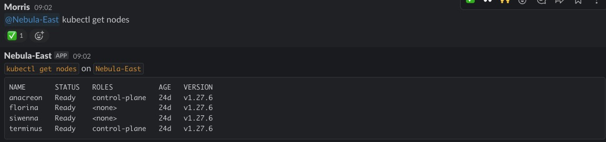

Deploy self-hosted Botkube in Kuberneates with Slack Integration and RBAC
==================

Create Botkube Slack App
------------
Follow the steps in the [docs](https://docs.botkube.io/installation/slack/socket-slack/self-hosted#create-slack-app) to create a Botkube Slack App

Note down the bot and app tokens for use duirng Botkube Installation

In the Slack window, add the Botkube app as a memebr of the kubernetes channel or any channel you wish to use


Install Botkube with Helm
------------

Create a working directory, install botkube helm repository and fetch the botkube helm chart
```sh
mkdir -p botkube && cd botkube
helm repo add botkube https://charts.botkube.io
helm fetch botkube/botkube --untar
```

Configure Botkube by editing the values.yaml file.
```sh
vi botkube/values.yaml
```

Configure Botkube by editing the values.yaml file. 

Enable _socketSlack:_ under _communications:_ and set the name of the default channel to match the name of your actual Slack channel. 

Set the botToken and appToken values to the tokens you retrieved during the _Create Botkube Slack App_ step
```sh
communications:
  'default-group':
    socketSlack:
      enabled: true
      channels:
        'default':
          name: 'kubernetes'
          # ... trimmed ...
      botToken: 'BOT_TOKEN'
      appToken: 'APP_TOKEN'
```

Enable the Helm and Kubectl executors
```sh
executors:
  k8s-default-tools:
    botkube/helm:
      enabled: true
      # ... trimmed ...
    botkube/kubectl:
      enabled: true
      # ... trimmed ...
```
Set the name of the cluster
```sh
settings:
  clusterName: Nebula-East
```

Deploy a new Botkube release
```sh
kubectl create ns botkube
helm install botkube botkube/. -n botkube
```

Verify Botkube Installation 
------------

In Slack under the _kubernetes_ channel run kubectl commands like this

@SLACK_APP_NAME kubectl get nodes



Creating Aliases 
------------

Create aliases in the values.yaml file ubder _aliases:_. See the custom-values.yaml file for full configuration.
```sh
aliases:
  # ... trimmed ...
  kgp:
    command: kubectl get pods
    displayName: "Kubectl get pods alias"
  # ... trimmed ...
```

Upgrade the Botkube release
```sh
helm upgrade botkube botkube/. -n botkube
```

Creating Custom Configuration 
------------
Add a new configmap in the values.yaml file under _extraObjects:_. This custom configuration lets you control the namespaces from which Botkube will watch for and report events. See the custom-values.yaml file for full configuration. 
```sh
extraObjects: 
    - apiVersion: v1
      kind: ConfigMap
      metadata:
        name: botkube-custom-config
      data:
        _custom_config_b: |-
            sources:
              k8s-recommendation-events:
              # ... trimmed ...
              k8s-err-events:
              # ... trimmed ...
              k8s-err-events-with-ai-support:
              # ... trimmed ...
              k8s-all-events:
              # ... trimmed ...
```
Add the configmap as a volume under _extraVolumes:_ and create a mount of this volume under _extraVolumeMounts:_

```sh
extraVolumes: 
  - name: botkube-custom-config-vol
    configMap:
      name: botkube-custom-config

# ... trimmed ...

extraVolumeMounts: 
  - name: botkube-custom-config-vol
    mountPath: /custom-config/_custom_config_b
    subPath: _custom_config_b
```

Add the new configuration file to the BOTKUBE_CONFIG_PATHS environment variable.

```sh
extraEnv:
  # ... trimmed ...

  - name: BOTKUBE_CONFIG_PATHS                                               
    value: /custom-config/_custom_config_b,/config/global_config.yaml,/config/comm_config.yaml,/config/_runtime_state.yaml,/startup-config/_startup_state.yaml
```
Upgrade the Botkube release
```sh
helm upgrade botkube botkube/. -n botkube
```

Creating Actions 
------------
Enable the _show-logs-on-error_ cation in the values.yaml file under _actions:_. Ensure the sources k8s-err-with-logs-events and k8s-err-events are added under the bindings
```sh
actions:
   # ... trimmed ...
  'show-logs-on-error':

    # ... trimmed ....
    bindings:
      sources:
        - k8s-err-with-logs-events
        - k8s-err-events
      executors:
        - k8s-default-tools
```

Creating Sources for multiple Channels
------------
Find the _k8s-err-events_ source in the values.yaml file under _sources:_. 

Duplicate and rename it a couple of times to create two new sources k8s-err-events-database and k8s-err-events-platform. 

These will be sources that will only watch the dataase and system namespaces
```sh
sources:
  'k8s-recommendation-events':
    displayName: "Kubernetes Recommendations"
  # ... trimmed ...
  'k8s-all-events':
    displayName: "Kubernetes Info"
  # ... trimmed ...
  'k8s-err-events':
    displayName: "Kubernetes Errors"
  # ... trimmed ...
  'k8s-err-events-platform':
    displayName: "Kubernetes Errors"
  # ... trimmed ...
  'k8s-err-events-database':
    displayName: "Kubernetes Errors"
```

#### Create the channel configuration in the the values.yaml file. 

Under _communications:_ and then _socketSlack:_ duplicate the default channel a couple of times and rename it to create the database-admins, platform-engineers and support-l2 channels. 

```sh
communications:
  'default-group':
    socketSlack:
      enabled: true
      channels:
        'default':
        # ... trimmed ...
        'platform-engineers':
          name: 'platform-engineers'
          bindings:
            # ... trimmed ...
            sources:
              - k8s-err-events-platform

        'database-admins':
          name: 'database-admins'
          bindings:
            # ... trimmed ...
            sources:
              - k8s-err-events-database

        'support-l2':
          name: 'support-l2'
          bindings:
            # ... trimmed ...
            sources:
              - k8s-err-events
              - k8s-recommendation-events
              - k8s-err-events
```

#### Update the custom configuration with the two new sources
```sh
extraObjects: 
    - apiVersion: v1
      kind: ConfigMap
      metadata:
        name: botkube-custom-config
      data:
        _custom_config_b: |-
            sources:
              k8s-recommendation-events:
              # ... trimmed ...
              k8s-err-events:
              # ... trimmed ...
              k8s-err-events-with-ai-support:
              # ... trimmed ...
              k8s-all-events:
              # ... trimmed ...
              k8s-err-events-platform:
                botkube/kubernetes:
                  config:
                    namespaces:
                      include: 
                        - "kube-system"
                        - "metallb-system"
                        - "ingress-nginx"
              k8s-err-events-database:
                botkube/kubernetes:
                  config:
                    namespaces:
                      include: 
                        - "opensearch"
                        - "etcd"
```

This configuration ensures that the platform-engineers channel receives only error events from the kube-system, metallb-system and ingress-nginx namespaces.

The database-admins channel receives only error events from the opensearch and ectd namespaces.

The support-l2 channel will recieve  error events from all namespaces. 

Creating the new Channels in Slack
------------
Create new channels in Slack, e.g. platform-engineers, database-admins, support-l2 and add the Botkube Slack App to each channel

Upgrade the Botkube release
```sh
helm upgrade botkube botkube/. -n botkube
```

Verify that each channel is only receiving event notifications from the appropriate namespaces. 

Channel name based RBAC
------------

Create cluster roles, cluster role bindings and role bidnings which define permissions for each channel each channel. See the custom-values.yaml file for the full configuration. 

You can define this in the values.yaml file under _extraObjects:_

```sh
extraObjects: 
    # ... trimmed ...
    - apiVersion: rbac.authorization.k8s.io/v1
      kind: ClusterRole
      metadata:
        name: kubectl-read-pods
      rules:
      # ... trimmed ...
    
    - apiVersion: rbac.authorization.k8s.io/v1
      kind: ClusterRole
      metadata:
        name: editor
      rules:
      # ... trimmed ...
      
    - apiVersion: rbac.authorization.k8s.io/v1
      kind: ClusterRoleBinding
      metadata:
        name: kubectl-read-pods
      roleRef:
        apiGroup: rbac.authorization.k8s.io
        kind: ClusterRole
        name: kubectl-read-pods
      subjects:
        - kind: Group
          name: support-l2 
          apiGroup: rbac.authorization.k8s.io
        
    - apiVersion: rbac.authorization.k8s.io/v1
      kind: RoleBinding
      metadata:
        name: editor
        namespace: opensearch
      roleRef:
        apiGroup: rbac.authorization.k8s.io
        kind: ClusterRole
        name: editor
      subjects:
        - kind: Group
          name: database-admins
          apiGroup: rbac.authorization.k8s.io
      # ... trimmed ...
```

The support-l2 channel will be able to perform basic support tasks like listing and watching pods.

The database admins will be able to deploy, update and delete any resources in all database namespaces.  

The Platform engineers will have full access to the entire cluster.

Create a compatible executor. The default k8s-default-tools is also used by Actions which does not support the ChannelName RBAC policy. 

Duplicate the the _k8s-default-tools_ executor in the values.yaml file under _executors:_ and rename it to _k8s-default-tools-rbac_. Set the rbac cofniguration under context for the helm and kubectl tools.

```sh
executors:
  k8s-default-tools:
  # ... trimmed ...

  k8s-default-tools-rbac:
    botkube/helm:
      enabled: true
      config:
        defaultNamespace: "default"
        helmDriver: "secret"
        helmConfigDir: "/tmp/helm/"
        helmCacheDir: "/tmp/helm/.cache"
      context:
        rbac:
          group:
            type: ChannelName

    botkube/kubectl:
      enabled: true
      config:
        defaultNamespace: "default"
      context:
        rbac:
          group:
            type: ChannelName
```

Update the channel bindings in the values.yaml file under _communications:_ and replace the _k8s-default-tools_ executor with _k8s-default-tools-rbac_.
```sh
communications:
  'default-group':
    socketSlack:
      enabled: true
      channels:
        'default':
        # ... trimmed ...
        'platform-engineers':
          name: 'platform-engineers'
          bindings:
            executors:
              - k8s-default-tools-rbac
            # ... trimmed ...
            sources:
              - k8s-err-events-platform

        'database-admins':
          name: 'database-admins'
          bindings:
            executors:
              - k8s-default-tools-rbac
            # ... trimmed ...
            sources:
              - k8s-err-events-database

        'support-l2':
          name: 'support-l2'
          bindings:
            executors:
              - k8s-default-tools-rbac
            # ... trimmed ...
            sources:
              - k8s-err-events
              - k8s-recommendation-events
              - k8s-err-events
```

Upgrade the Botkube release
```sh
helm upgrade botkube botkube/. -n botkube
```


### Testing RBAC configuration

The support-l2 channel can list pods, but cannot create any resources.

Database-admins channel should be able to view and create all resources in the database namespaces but not from any other namespaces. 

Platform enginners can perform all tasks. 